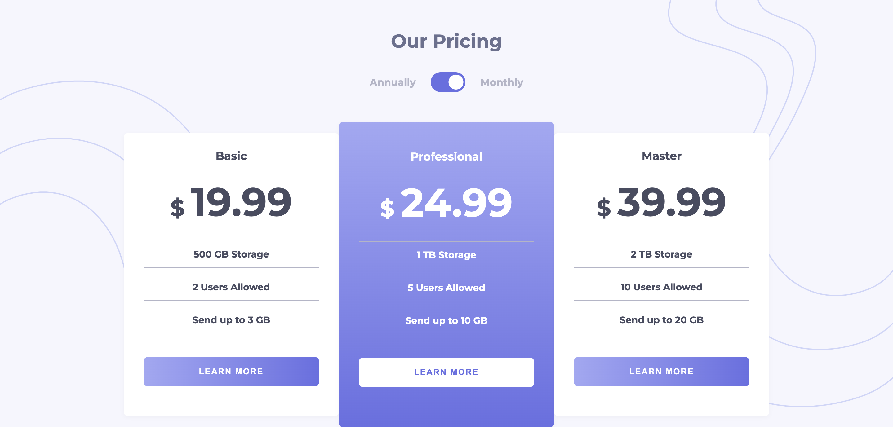
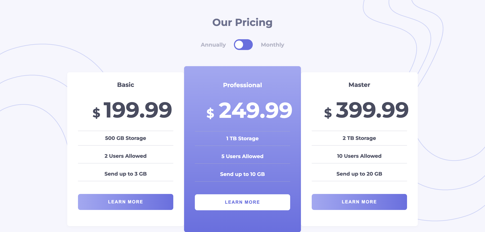
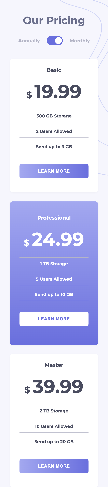
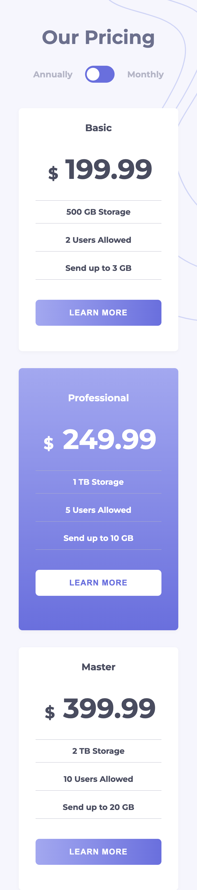

### The challenge

Users should be able to:

- View the optimal layout for the component depending on their device's screen size
- Control the toggle with both their mouse/trackpad and their keyboard

### Screenshot

### Built with

- Semantic HTML5 markup
- CSS custom properties
- Flexbox

### What I learned

I learned ,To enhance responsiveness, it's preferable to utilize "transform: translate" when employing absolute positioning.

## Author

- Frontend Mentor - [@maziarja](https://www.frontendmentor.io/profile/maziarja)

## Acknowledgments

I appreciate Jonas Schmedtmann for his awesome courses on Udemy.
